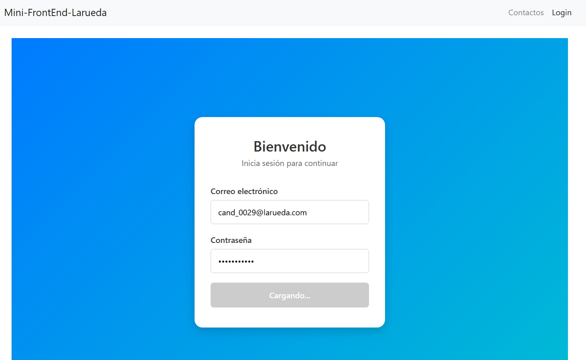
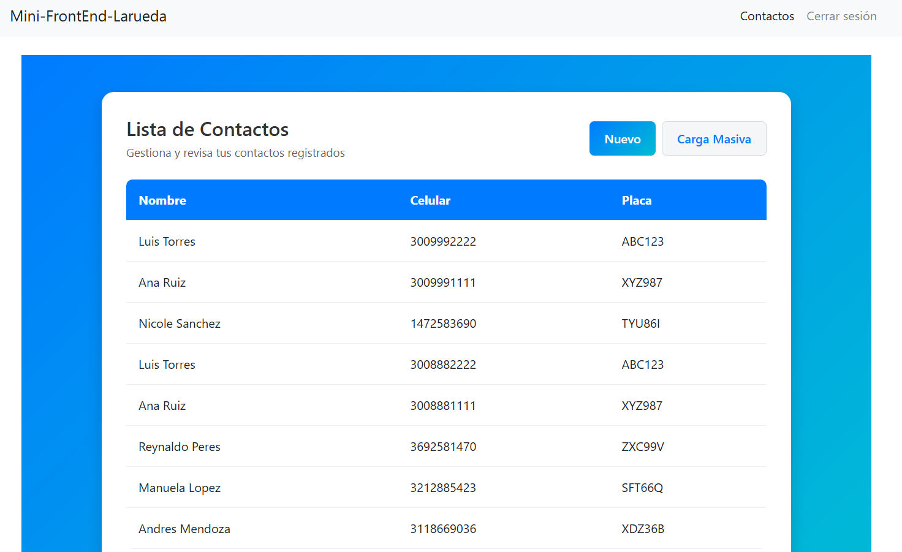
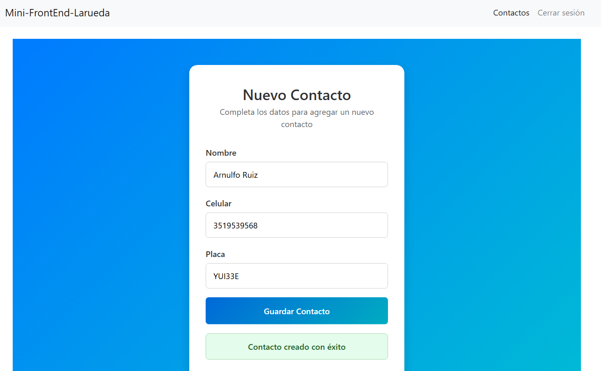
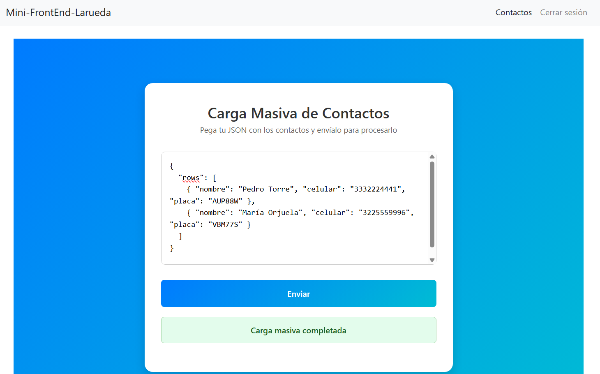

### 📘 Mini FrontEnd - La Rueda

Este proyecto es un mini frontend desarrollado en Angular 11 como parte de una prueba técnica para evaluar habilidades prácticas en Angular y consumo de APIs Laravel.

El sistema permite:

Autenticación de usuario

Listado de contactos

Creación individual de contactos

Carga masiva de contactos mediante JSON# MiniFront-Angular

### 🚀 Tecnologías Utilizadas

Angular 11

TypeScript

Bootstrap 4

RxJS / Observables

API Laravel

### ⚙️ Instalación y Configuración

git clone https://github.com/MrBaiper/MiniFront-Angular.git

cd frontend

npm install
    (
        Node.js v14 o superior
        Angular CLI v11 (npm install -g @angular/cli@11)
    )

### 🧪 Ejecución del Proyecto

ng serve

### 🔐 Endpoints Principales (API Laravel)

| Método | Endpoint       | Descripción               |
| :----- | :------------- | :------------------------ |
| POST   | /auth/login    | Autenticación             |
| GET    | /contacts      | Lista contactos           |
| POST   | /contacts      | Crea contacto             |
| POST   | /contacts/bulk | Carga masiva de contactos |

### 🧾 Testing en Local

Login: 

Listado: 

Creacion: 

Carga Masiva: 
